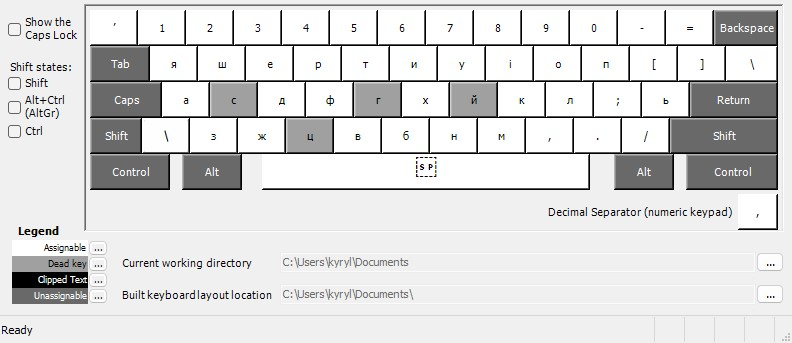
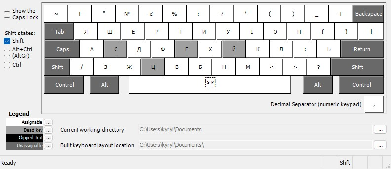

# Ukrainian Mnemonic Keyboard Layout

A mnemonic layout for Windows 10 and 11 based on character combinations.

| Base Key | Modifier | Result |
|:---------|:---------|:-------|
| `й`      | `і`      | `ї`    |
| `с`      | `ц`      | `щ`    |
| `с`      | `Space`  | `с`    |
| `й`      | `а`      | `я`    |
| `й`      | `у`      | `ю`    |
| `й`      | `Space`  | `й`    |
| `г`      | `ʼ`      | `ґ`    |
| `г`      | `Space`  | `г`    |
| `ц`      | `х`      | `ч`    |
| `ц`      | `Space`  | `ц`    |

## Visual Layouts

